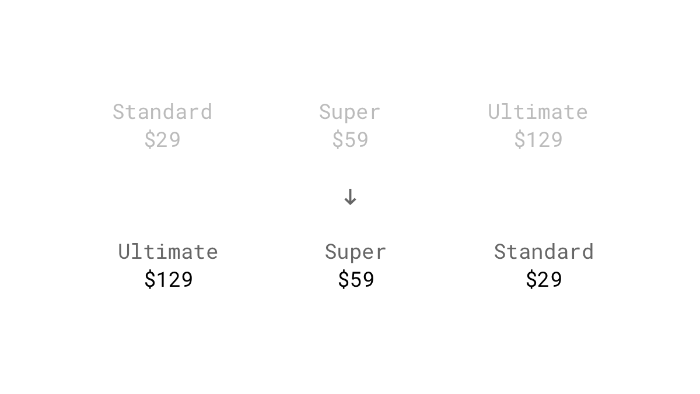
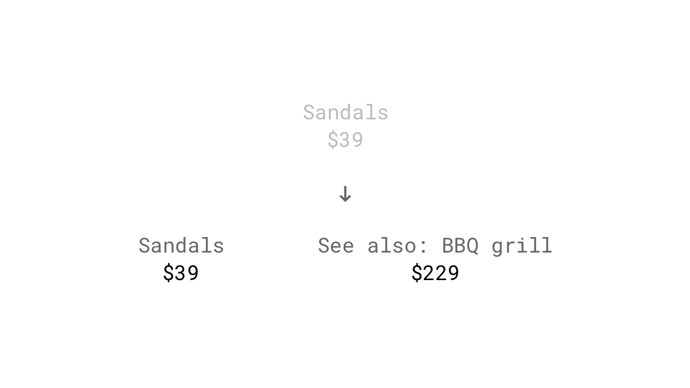
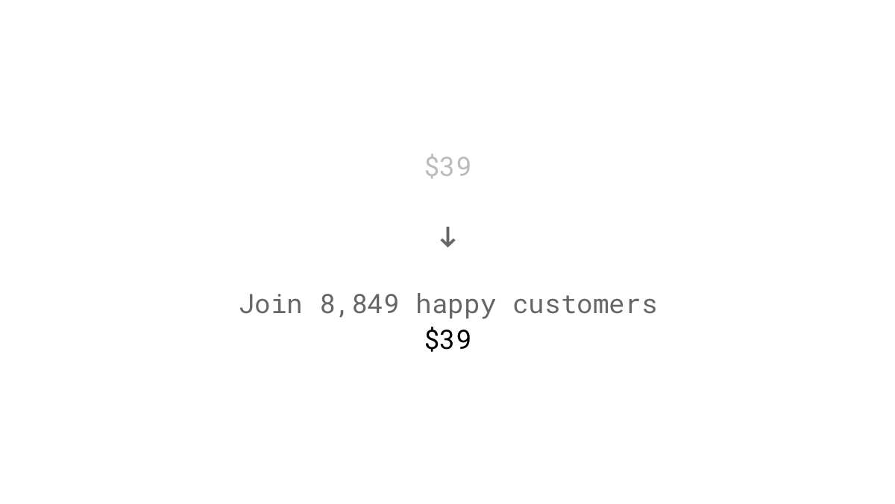
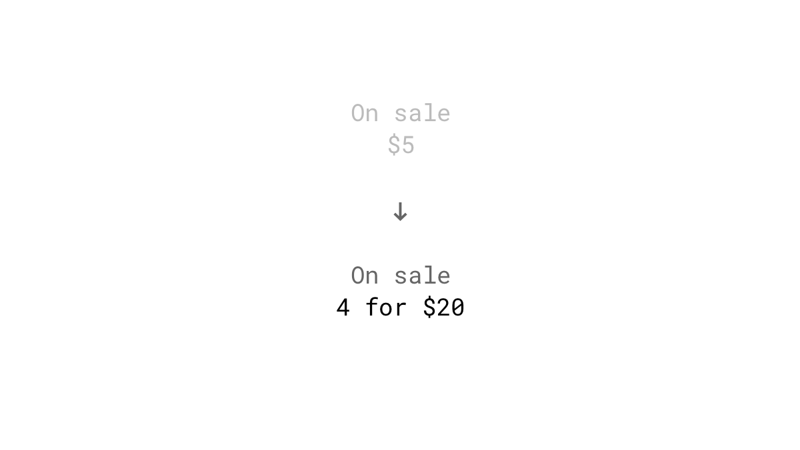
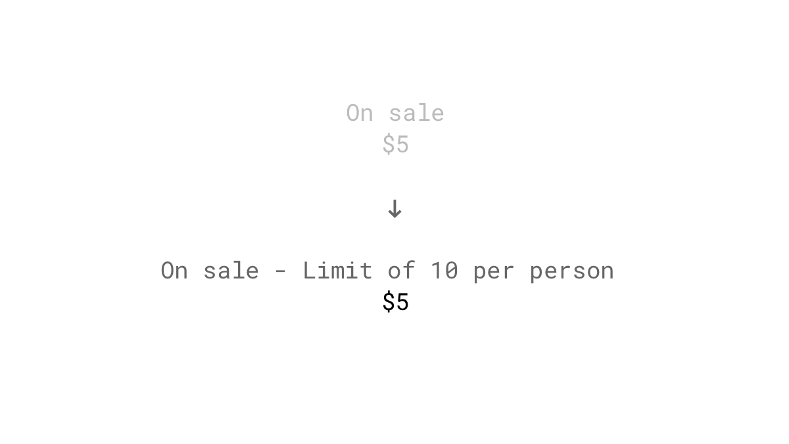

We tend to rely too heavily on one piece of information, mostly the first one when making a decision or estimating the value of uncertain objects. This initial "anchor" value is used as a mental reference point which might influence the choice people will make.

## Studies

Two groups of high school students were asked to compute, within 5 seconds, the product of the numbers one through eight (1 x 2 x 3...) or reversed (8 x 7 x 6...).  Because of the short time, they had to estimate the product after the first multiplications. These first results gave an anchor for their final answer. The median estimate of the first group was 512, while the median for the descending sequence was 2,250. Correct is: 40,320. ([Tversky & Kahneman., 1974](http://science.sciencemag.org/content/185/4157/1124))

Job seekers who anchor first and high in salary negotiations usually get a higher wage. ([Thorsteinson, 2011](http://onlinelibrary.wiley.com/doi/10.1111/j.1559-1816.2011.00779.x/abstract))

Judges score better than others on some cognitive illusions like the framing effect (treating economically equivalent gains and losses differently) or representativeness heuristic (ignoring background statistical information in favor of individuating information) but are equally prone to the anchoring effect. ([Guthrie, Rachlinski & Wistrich, 2001](https://papers.ssrn.com/sol3/papers.cfm?abstract_id=257634))

## Examples

### Highest price first
Anchor the price of the most expensive package of your product to the user's mind by listing it first. This order makes the subsequent plan seem like a bargain.

### Lower price first
Wait, didn't you just say the opposite? If the price difference is not too high, try to anchor the lower price. Therefore the slightly more expensive but significantly more valuable offer looks like a steal.

### Listing higher-priced unrelated products
A study shows that exposure to higher prices, even for unrelated products can impact people's willingness to pay for goods and services. ([Nunes & Boatwright, 2004](https://msbfile03.usc.edu/digitalmeasures/jnunes/intellcont/Incidental%20Prices-1.pdf))

### Exposing users to any high number
Anchoring works with any number, no matter whether that number is a price. ([Adaval & Monroe, 2002](http://www.jstor.org/stable/10.1086/338212?seq=1#page_scan_tab_contents))

### Multiple-unit pricing
The number of units in a promotion serves as an anchor and indicates which quantity the customer should buy. In an experiment, this tactic increased sales by 32%. ([Wansink, Kent & Hoch, 1998](http://foodpsychology.cornell.edu/sites/default/files/unmanaged_files/Anchoring-JMR-1998.pdf))

### Exposing users to a quantity limit
A study evaluated if setting quantity limits affects the shopping behavior. Buyers purchased an average of 3.3 cans of soup when they had no limit, whereas shoppers with a limit of 12 bought an average of 7 cans. ([Wansink, Kent & Hoch, 1998](http://foodpsychology.cornell.edu/sites/default/files/unmanaged_files/Anchoring-JMR-1998.pdf))

