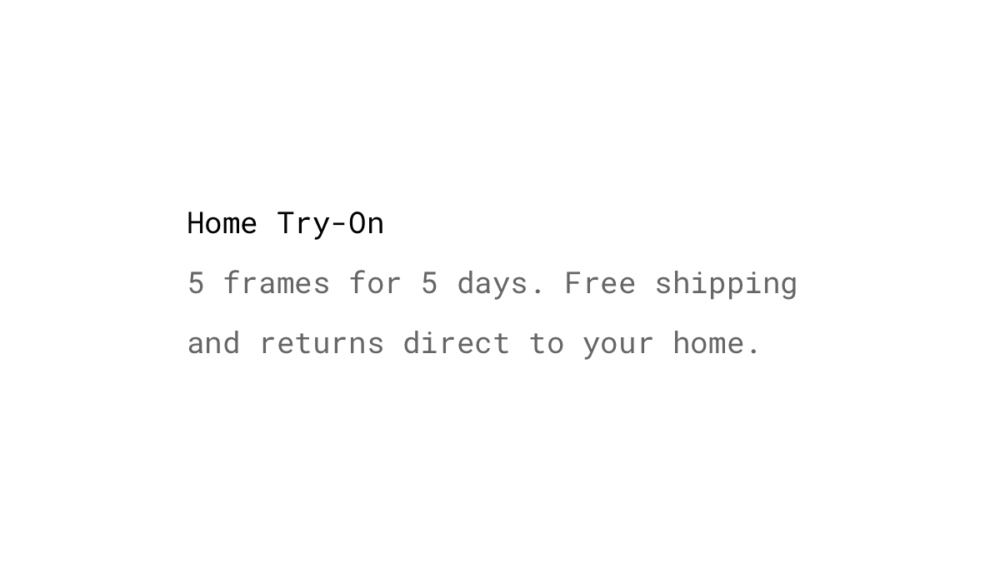
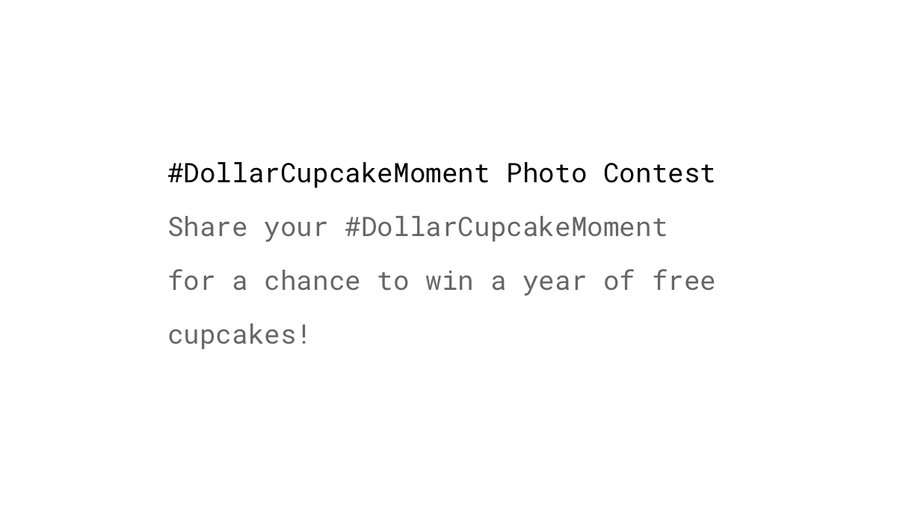
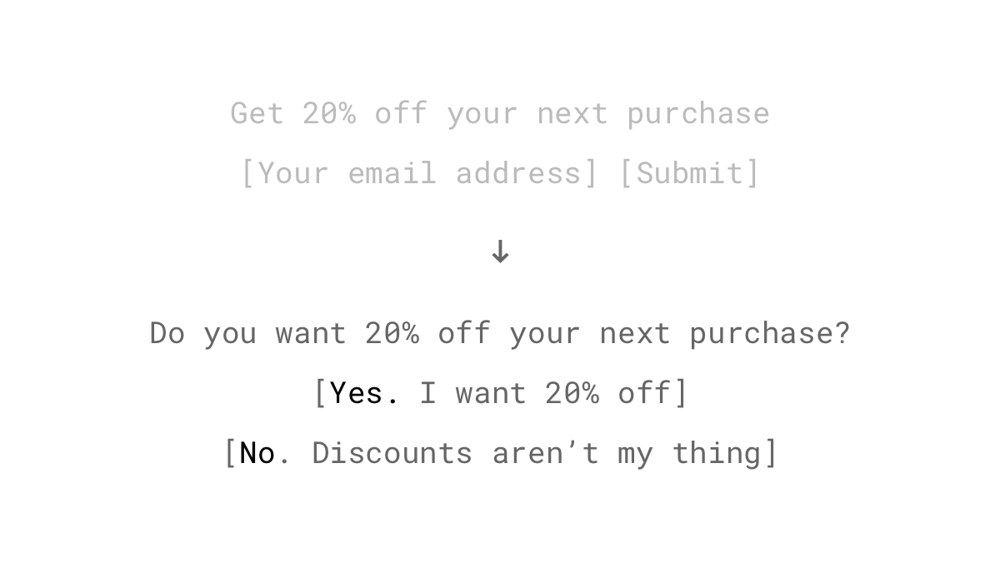
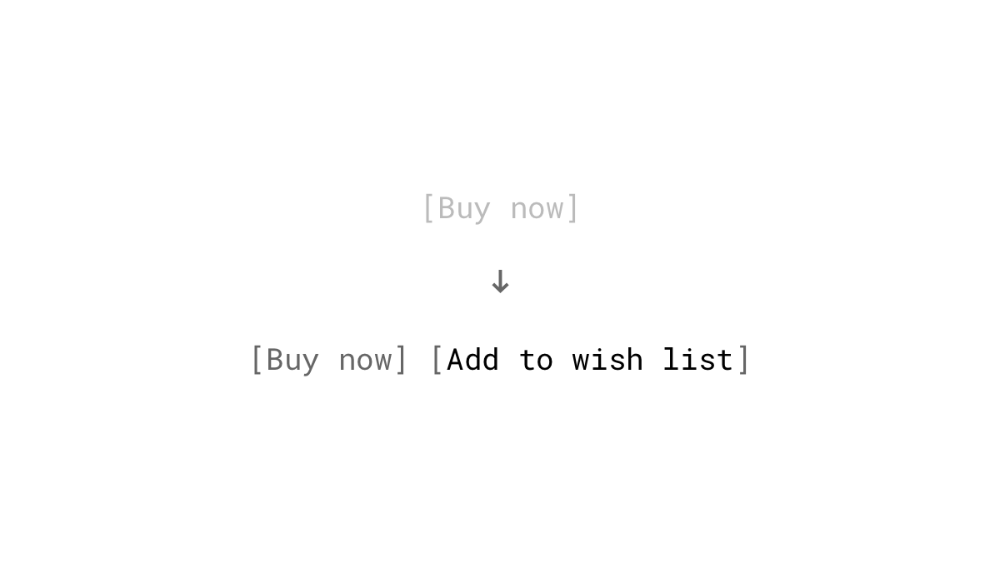
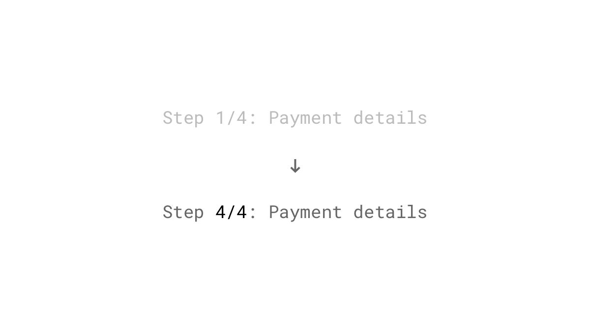
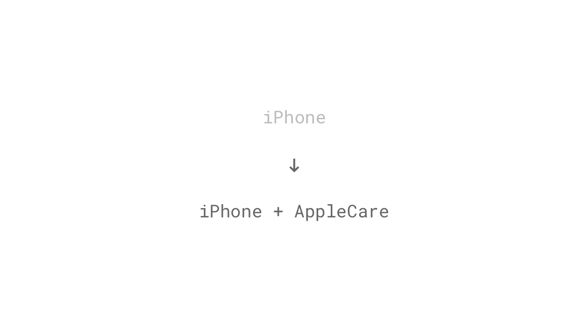

We are driven to be consistent in all areas of life. When we make a promise, we feel obligated to fulfill. When we make a decision, have an opinion or act in a particular manner, we strive to make all future behaviors match the past actions and decisions. We tend to justify these commitments by seeking confirmation and providing reasons for supporting them.

## Studies

Everyone knows or was even a part of projects where costs exploded by many times. Sometimes managers and even entire organizations seem almost programmed to follow a direction which is doomed to failure. **Escalation of commitment** refers to the tendency to stay with a decision and to dedicate additional effort, money and time into a course of action that is failing. We [don't want to lose](/loss-aversion/) the resources already invested and don't want to appear inconsistent. ([Staw, 1976](http://citeseerx.ist.psu.edu/viewdoc/download?doi=10.1.1.470.3668&rep=rep1&type=pdf))

"I will keep reading this book that I'm 100 pages into although I don't really like it." Sounds familiar? Sure, you spent the money on the book and your time already but you can’t get it back. This distortion of our decisions by emotional investments is called the **sunk cost fallacy**.  It leads us to continue a behavior as a result of previously invested resources. ([Arkes & Blumer, 1985](http://citeseerx.ist.psu.edu/viewdoc/download?doi=10.1.1.452.2318&rep=rep1&type=pdf))

The **Ikea effect** is a cognitive bias in which we disproportionately value things more if we put work in them. This phenomenon has a range of possible explanations: A successful completion of a task gives us the feeling of competence and puts us in a positive mood. Another reason could be that we like to justify the efforts that we've invested in a product, so we tend to like it more. ([Norton, Mochon, & Ariely, 2012](http://www.hbs.edu/faculty/Pages/item.aspx?num=41121))

People use the current situation as a reference point, and any change from that is perceived as a loss. We prefer familiarity and tend to resist change. This phenomenon is known as the **status quo bias**. ([Samuelson & Zeckhauser, 1988](https://sites.hks.harvard.edu/fs/rzeckhau/SQBDM.pdf))

## Examples

### Home try-on programs
Many online eyeglass retailers let their potential customers receive multiple glasses to try on before buying. The convenience of this service lets someone find the perfect frames and get feedback from friends and family. They say there's no commitment, but the moment you put a pair of their glasses on your face, it's unlikely that you'll move forward without buying.

### Social media contests
Run a contest that encourages your prospective customers to self-identify as fans of your brand by requiring them for example to upload a photo of them in a particular situation. When someone made a public commitment, it’s easier to get them to do stuff. The more public, the stronger is the influence on future actions. A study shows that people who state publicly that they want to lose weight were significantly more successful ([Nyer & Delande, 2009](http://onlinelibrary.wiley.com/doi/10.1002/mar.20316/abstract)).

### Online auctions
Auction sites are designed to push peoples emotional buttons. Even before it begins, bidders imagine themselves in a winning situation. With their first bid, commitment and consistency kick in. It's not uncommon that potential buyers increase their maximum bid above a value they're comfortable with, just to win an item. Many describe this phenomenon as *auction fever*.

### Pop-ups with Yes/No questions
Let's face it: Pop-ups are not the most pleasant things on the internet - but they seem to work for some people very well. There is a trend in the recent years where visitors are given a choice when a pop-up appears: either say "yes" to leave your email address in a second step to get a freebie, or be foolish and choose "no". This tactic is commonly known as the *foot-in-the-door* technique, where a small agreement paves the way for subsequent, larger requests ([Freedman & Fraser, 1966](https://www.researchgate.net/publication/17217362_Compliance_Without_Pressure_The_Foot-in-the-Door_Technique)).

### Wish lists
Give customers a choice between buying the product immediately or saving it for another time. E-commerce sites like Amazon know that when you add something to your wish list, you will be more likely to buy these items later because you have already acknowledged your desire to do so.

### Asking for sensitive information last
When setting up a payment or onboarding process, ask your users for personal details like the email address or credit card information at the end. By starting with the easiest tasks, your user will already be fully engaged in the process when it comes to the more sensitive information. Because he already invested his time so far, the user will be more likely to complete the whole process (sunk cost fallacy).

### Cross-selling
Remember that smartphone you checked out online? The store may have recommended a screen protector or case to go along with your phone. That's cross-selling. When we decide to buy something, we're more inclined to buy additional accessories as we want to justify our initial decision and to remain consistent with it. Amazon, for example, attributes up to [35% of its revenue](http://www.the-future-of-commerce.com/2013/10/14/ecommerce-cross-sell-up-sell/) to cross-selling.

### Freemium
- Dropbox

