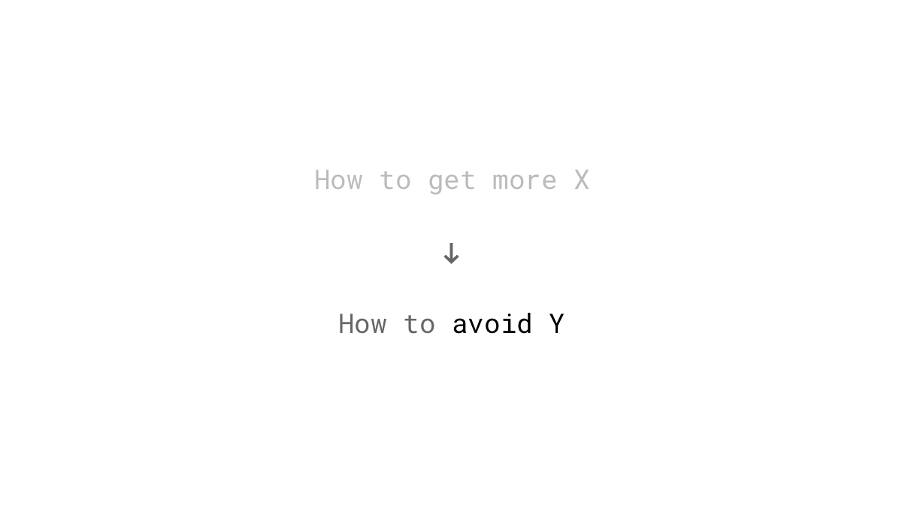

People feel losses more deeply than gains of the same value. In other words, it's more painful to lose something than the positive feelings from the getting the same thing.

Imagine you overhear your boss talking to the HR manager about giving you a raise of $200 per month. How would you feel about this surprising boost in pay? How would you feel if you hear your boss saying he wants to cut your salary by the same amount?

## Studies

We tend to give losses twice as much more psychological weight as gains. ([Tversky & Kahneman, 1992](http://cemi.ehess.fr/docannexe/file/2780/tversjy_kahneman_advances.pdf))

Losses have not as much as an impact as they are predicted. We tend to overestimate to dwell on negative experiences. Therefore is loss aversion more a property of forecasts than a characteristic of an actual experience. ([Kermer, Driver-Linn, Wilson & Gilbert, 2006](http://journals.sagepub.com/doi/abs/10.1111/j.1467-9280.2006.01760.x))

Investors tend to be more prone to "Myopic Loss Aversion" (MLA), a concept of a combination of high sensitivity to losses and a tendency to check their wealth too frequently. This bias leads to a short-term view that causes irrational decisions. ([Haigh & List, 2005](http://onlinelibrary.wiley.com/doi/10.1111/j.1540-6261.2005.00737.x/full))

## Examples

Loss aversion is a powerful marketing tool, and in in the digital context, it can be used to motivate a user to start or continue a desired task.

### Focusing on the loss in offers

Talk of what your potential customer will lose if they don’t purchase rather than what they would gain by buying.

### Focusing on the loss in headlines

The same principle can also be applied to headlines of landing pages or blog posts.

### Free trials

Loss aversion is one of the reasons why free trials work so well for SaaS businesses. When for example the 30 days of the trial period end, giving up the complete service or some premium features feels like losing.

### Pre-filling the shopping cart

Preload the shopping cart with discounted upsells. Users will hesitate to remove them from the cart as they have already "got" them. If they don't buy the upsells now, at the discounted price, they feel they're likely to miss out on saving some money. This tactic may be considered as a dark pattern. Users can overlook the additional items and buy them without knowing it.

