Triggers are anything that cues us to complete a particular action. They tell us what to do next and come in the form of internal and external triggers.

External triggers are all around us. They target our senses and remind us to take a particular action. It can be something obvious like a "Click here" button but also something like a delicious smell of fresh coffee and cake, while you're walking down the street.

Internal triggers, on the other hand, are impulses which come from within us. Memories, emotions or situations provide the information for what to do next. For example, the fear of losing out a moment triggers some people to take a photo and post it on Instagram. Internal triggers are a major factor for building habit-forming products and are the drivers for the growth of billion dollar companies.

## Studies

Ivan Pavlov demonstrated that dogs could be conditioned to salivate at the sound of a bell. He trained the dogs to respond in that way by ringing a bell before feeding them. This learning procedure came to be known as classical conditioning. ([Pavlov, 1927](http://psychclassics.yorku.ca/Pavlov/))

According to BJ Fogg's behavior model, three elements must be present for the desired behavior to occur: motivation, ability, and trigger. In other words, it has to bring value, be simple to complete and should draw attention. If one or more is missing, the desired action will not happen. ([Fogg, 2009](http://dl.acm.org/citation.cfm?doid=1541948.1541999))

## Examples

### Paid media
Everything from web banners to paid search marketing is used to acquire new customers and falls within the category of paid triggers. It's an effective way to expose your product's name to a broad audience within a short time. Paid channels will continue to evolve with more features aimed at providing better audience targeting and thus better experiences for the visitors. According to the research from [Ascend2](http://research.ascend2.com/2017-content-marketing-distribution-survey-summary-report/), say 67% of the marketers interviewed that search engine marketing is the most effective paid channel to distribute content, followed by social media ads with 50%.

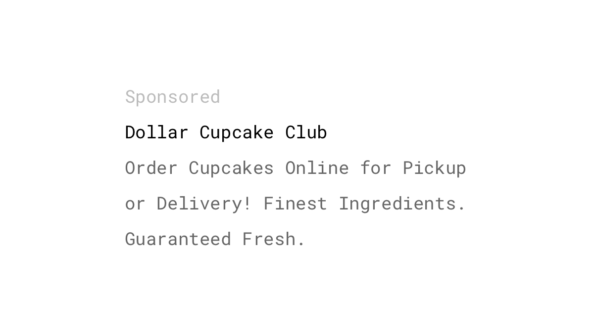

### Owned media
A high-quality digital presence is critical to success. Owned media refers to the content you create and publish on channels you own. That includes the main website, blogs, newsletters but also any social media presence which all act as an extension of your brand. The more owned media you have, the more potential external triggers you have to provide to acquire new visitors. Owned media leads to earned media.

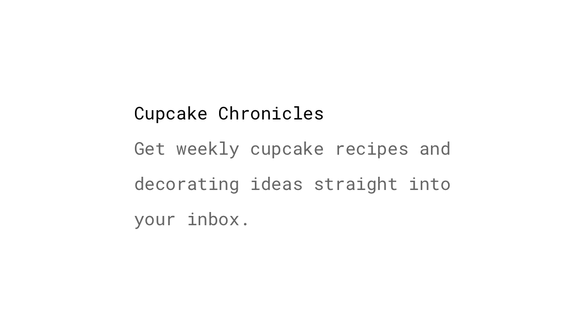

### Earned media
In contrast to paid media, which gets in front of people by payment, refers earned media to exposure you've gained through word-of-mouth. Earned media is the tweet that praises your service. It's the blog post that mentions your product and got shared by thousands. Establish yourself and your business as the leader in your niche which will give you a ton of [social proof](/social-proof/) and credibility. Not everybody will like your brand. By publicly acknowledging hate against your business you will increase the positive word-of-mouth created by your brand lovers ([Monahan, Espinosa & Ortinau, 2017](https://www.researchgate.net/publication/314266211_Hate_Does_Not_Have_to_Hurt_The_Influence_of_Hate-Acknowledging_Advertising_on_Positive_Word_of_Mouth_An_Extended_Abstract)).

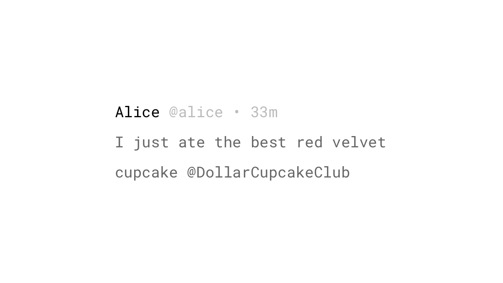

### Call to actions
Every CTA like a button or some other form of graphic or text which guides your users and tells them what to do next is an external trigger. Even the smallest tweaks in copy, color, position or size can lead to huge lifts in the conversion rate: Black and Decker, for example, saw a [17% increase in click-through rate](https://blog.optimizely.com/2014/07/03/black-decker-discovers-big-win-in-buy-now-vs-shop-now-test/) by using "Buy now" instead of "Shop now." Even two words on a button can have a huge impact on essential metrics.

### App icon on home screen
We [touch our phone 2,617 times a day and unlock it 76 times](https://blog.dscout.com/mobile-touches). Whenever we see the grid of apps, we're confronted with potential triggers. Red badges, which signal what we've missed, increase the sense of urgency in opening specific apps even more. You can even prompt an ["Add to home screen" banner](https://developers.google.com/web/fundamentals/engage-and-retain/app-install-banners/) on your mobile website to have it launch in the full-screen mode like a real native app.

### Push notifications
According to Localytics, [52%](http://info.localytics.com/blog/52-percent-of-users-enable-push-messaging) of all mobile users enable push notifications on their phone. If done right, they can have open-rates up to [80%](http://blog.thanx.com/push-notification-open-rate-statistics-50-80) and are therefore effective external triggers to persuade people to complete certain tasks. Good push notifications are well-timed, explicit and spark someone's curiosity.

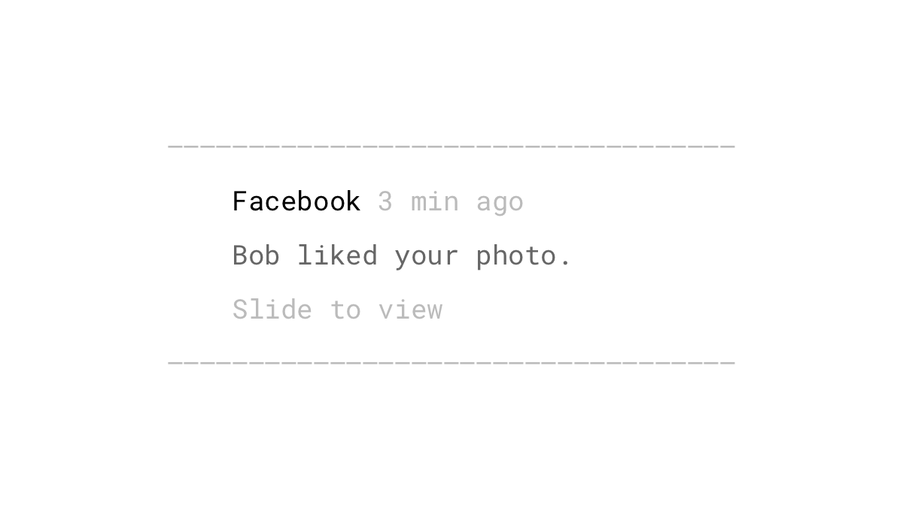

### Software updates
Have you ever been remembered through app updates that you have an app installed which you've forgotten that it's on your phone? Releasing updates strategically can be a part of your marketing to retain existing users. Mobile systems like iOS and Android have update notifications built in. In addition to that or for other platforms like web and desktop you can send product update emails to inform your users about new features.

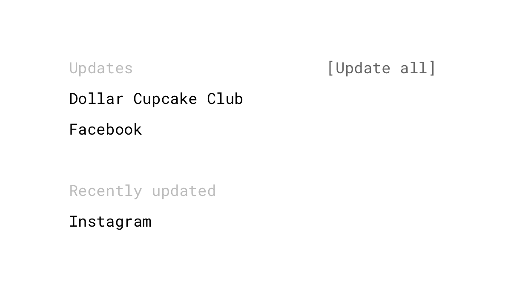

### Browser extensions
Look at your menu bar in your browser. How many third party add-ons do you see there? Each time you open your browser you notice consciously or unconsciously these shiny icons. For many companies like Pinterest, Buffer or Pocket are browser extensions an essential part of a seamless workflow.

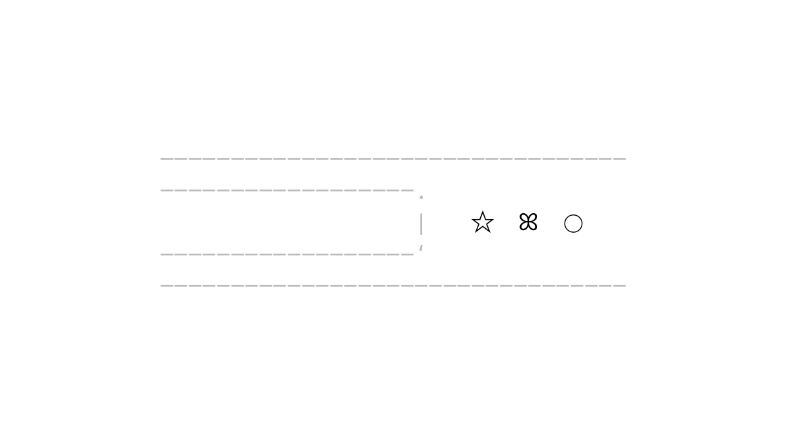

### Unread count badge
There are two types of users: those with hundreds of unread notifications, and those who can't relax until everything is cleared out. Notification badges are an easy way to indicate if there have been new activities or actions requiring our interest. This feature is often seen above mobile app icons, in the header of web applications but it's also possible to show a [counter in your favicon](http://lab.ejci.net/favico.js/) of your website.

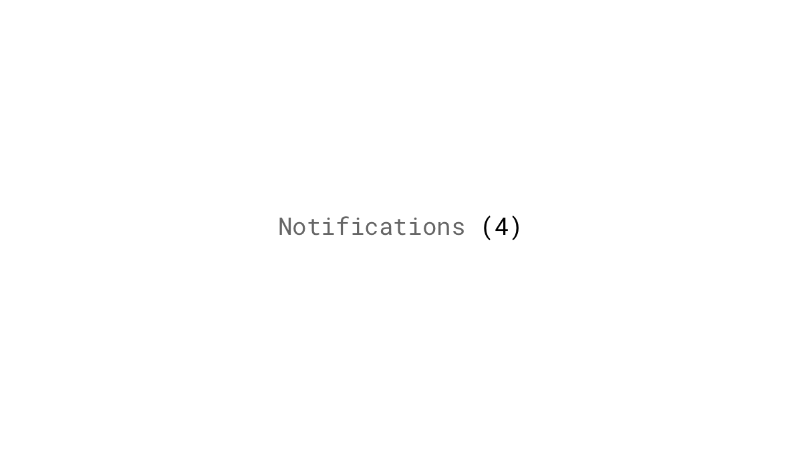

### Transactional emails
You sign up for a web app, and get welcomed with a lovely message in your inbox – that's a transactional email. A user's interaction or a time-based condition triggers these types of notifications. According to an email marketing study conducted by IBM, have transactional emails a [higher open-rate by 116%](https://www-01.ibm.com/marketing/iwm/dre/signup?source=urx-13772&S_PKG=ov56286) than marketing emails because they're personalized, and we typically expect them. Common use cases include welcome emails, password resets, purchase confirmations or some notifications of important activities going on in your application.

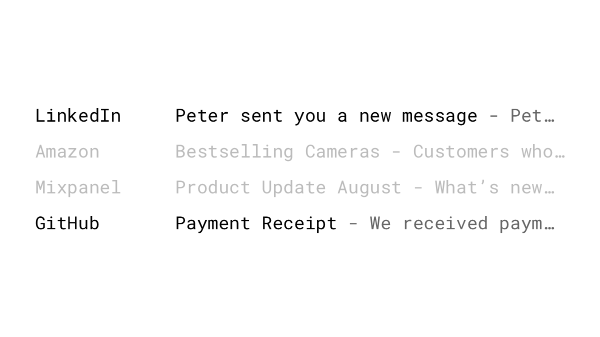

### Marketing emails
There are many names, but all describe the same type: Bulk, promotional, commercial, broadcast or just marketing emails. Unlike transactional emails, this kind is sent to more than one person that contains the same content. Just a customized salutation makes it not different. Some examples are messages about product updates, website launches, event invitations, exclusive offers or giveaways. It's a thin line between retaining existing customers and being marked as spam. Only email people who have given you permission, don't overdo it but also don't wait too long before contacting your subscribers. Stale email lists can lead to high bounce-rates and unsubscribes.

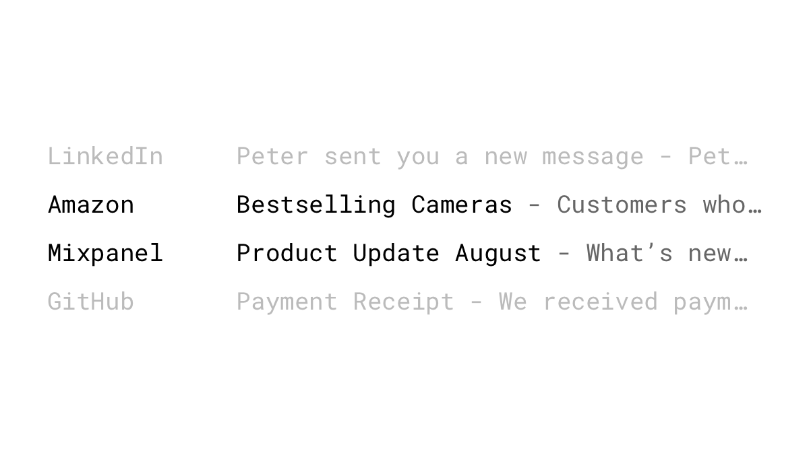

### Bookmarked sites
We as humans have a [fear of losing things that we already own](/loss-aversion/). So we bookmark websites that seem interesting –We hoard them literally. Once in a while, when we dare to go through the folder of bookmarks, we're faced with a huge list of potential triggers.

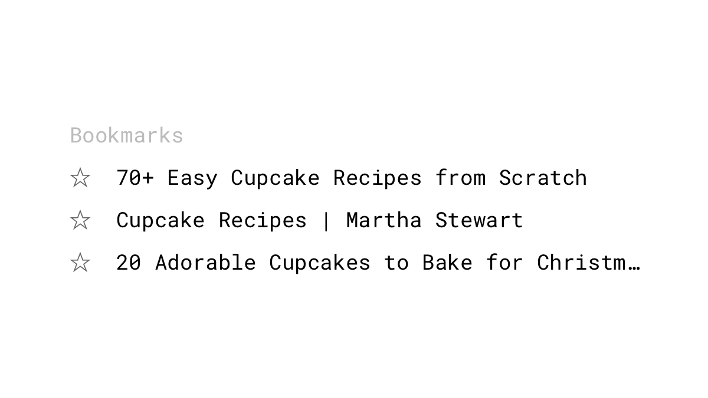

### Wish lists and favorites
Similar to the concept of bookmarks we often see a "favorites" feature in many applications. Amazon and Airbnb call them wish lists. Twitter stores your favorited tweets under *Likes* and on your phone, you can add contacts to the *Favorites*. Giving a bookmarking mechanism to your users can increase the overall engagement on your platform. With every added favorite, the [users commit them](/commitment-consistency/) more to the usage of the product.

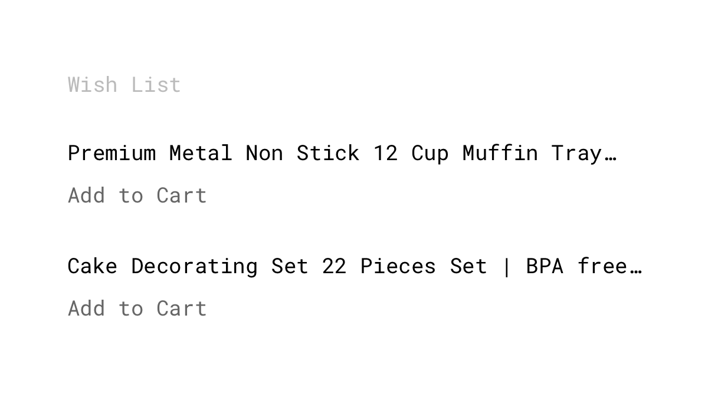

### Search suggestions
The autocomplete design pattern has become somewhat of a convention for search functionalities. Search suggestions can help to create better queries by guiding users to the results they want. It can also encourage an exploratory search when the shown suggestions are relevant.

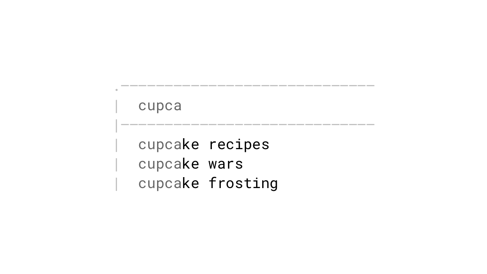

### Internal triggers
They happen all the time. Unlike external triggers like these from the previous examples, you can't see or hear an internal trigger. Internal triggers manifest automatically in mind through emotions, situations, places, and people around you. Especially negative emotions are powerful triggers. Just a spark of loneliness, boredom or fear of missing out will make us check Facebook, Instagram or Snapchat. Researchers find that people with depressive symptoms tend to [check their inboxes more often](http://www.nytimes.com/2012/06/17/opinion/sunday/how-depressed-people-use-the-internet.html?mcubz=3) which relates to high levels of anxiety. The holy grail is to convert external into internal triggers that bring a user back again and again by attaching your product to people's daily routines and emotions. Ask yourself in which situations your users find themselves when the desired habit could be built and see if an external trigger can be fired closely to that moment.

